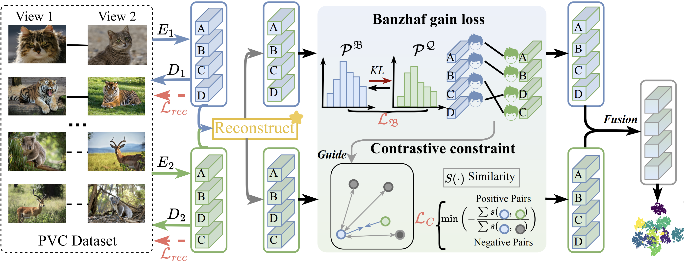

# <p align=center> Game Theory Inspired Cross-view Interaction Alignment for Partially View-aligned Clustering</p>

>**Authors:**
Shanghui Deng, Xiao Zheng, Chang Tang, Lianbo Guo, Xinwang Liu, Kunlun He

>**Published:**
IEEE Transactions on Pattern Analysis and Machine Intelligence

This repository contains simple pytorch implementation of our paper [BIN_V2]([https://ieeexplore.ieee.org/document/11557197](https://ieeexplore.ieee.org/document/11557197)).

### 1. Overview
<p align="center">
   <br/>
</p>

### 2. Usage

Train a new model:

````python
python run.py
````
### 3. Citation

Please cite our paper if you find the work useful:
```
@ARTICLE{deng2026game,
  author={Deng, Shanghui and Zheng, Xiao and Tang, Chang and Guo, Lianbo and Liu, Xinwang},
  journal={IEEE Transactions on Pattern Analysis and Machine Intelligence}, 
  title={Game Theory Inspired Cross-View Interaction Alignment for Partially View-Aligned Clustering}, 
  year={2026},
  volume={},
  number={},
  pages={1-15},
  doi={10.1109/TPAMI.2026.3702325}
}
```
